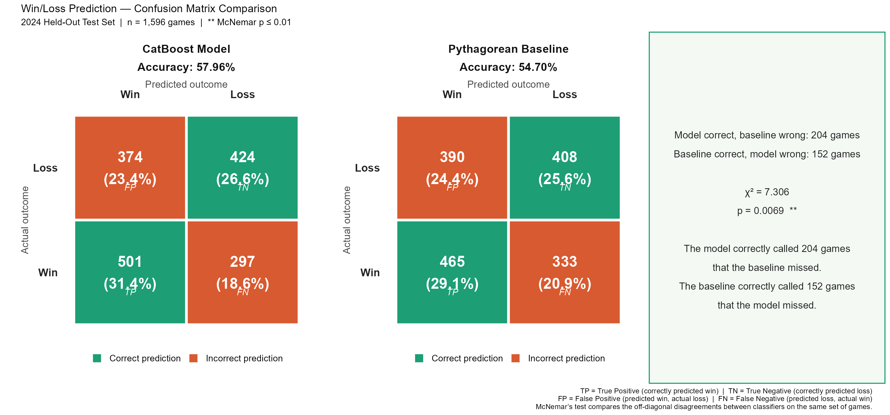
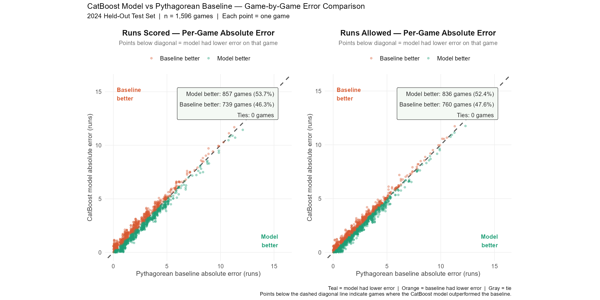
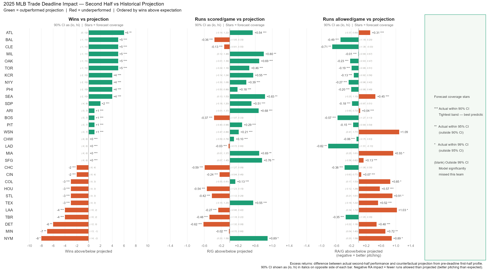
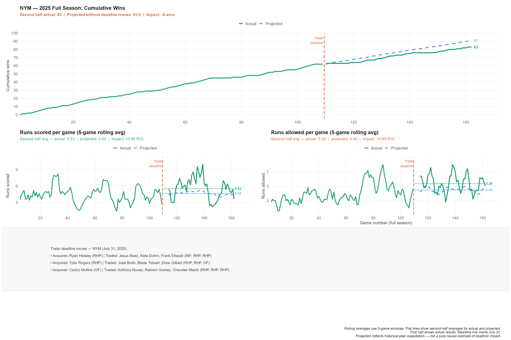
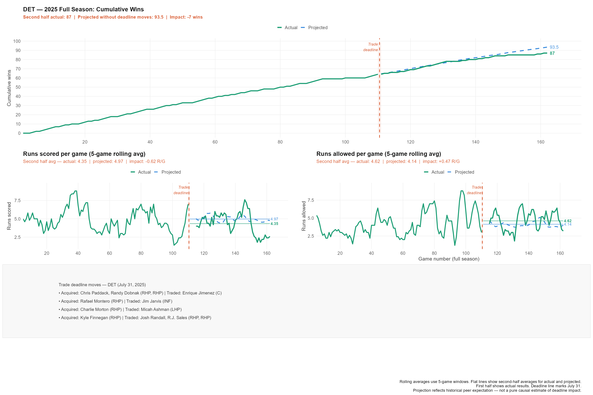

# MLB Trade Deadline Impact Model: An Interrupted Time Series Framework
**Developed by:** Micah Bentley (https://github.com/MLBentley-Data) & Jack Behnfeldt (https://github.com/jbehn-stonecold)  
**Date:** April 2026  

---

## Executive Summary
This repository contains a machine learning Interrupted Time Series (ITS) framework designed to quantify the true "excess returns" of the 2025 MLB Trade Deadline. By isolating team profiles at the July 31 trade boundary, the model constructs a historical counterfactual: predicting how a team would have performed over the second half of the season had they remain unchanged. 

Instead of relying on naive historical averages or basic run-differential regressions, this framework uses optimized **CatBoost** models to capture non-linear matchup features, giving front offices an empirical look at the marginal value of trade deadline acquisitions.

---

## 📊 Technical Architecture & Data Engineering
To prevent target leakage, all team performance vectors are frozen on July 31. The pipeline engineers **135 features** per game, focusing on team momentum, consistency, and roster depth:

***WLS Trend Slopes:** Weighted Least Squares curves that weight recent games more heavily, tracking a team's true velocity entering the deadline.

***Split Pitching Metrics:** Explicitly separates Starter ERA from Bullpen ERA and measures pitching staff volume distribution (Inning Share).

***Scoring Volatility:** Utilizes the Coefficient of Variation (`cv_run_diff`) to evaluate a team's scoring consistency independently of their raw run average.

***Opponent Mirroring:** Automatically mirrors the complete feature matrix for the projected opponent to account for strength of schedule in the second half.

---

## 📉 Statistical Performance & Validation (2024 Test Set)
Before scoring the 2025 season, the pipeline's predictive accuracy was rigorously validated against a baseline expectation on a completely held-out **2024 test set ($n = 1,596$ games)**.

### Model Performance vs. Pythagorean Baseline:
***Runs Scored Model:** Outperformed the baseline in **53.7%** of games (Paired t-test: $t = -2.10, p = 0.018$).

***Runs Allowed Model:** Highly significant improvement in runs allowed prediction (Paired t-test: $t = -2.93, p = 0.0017$).

***Win/Loss Classifier:** Achieved **57.96% accuracy** (compared to the baseline's 54.70%), yielding a highly significant **McNemar's test** result ($\chi^2 = 7.31, p = 0.0069$).

<p align="center">
  
  
</p>
]<p align="center"><em>Figure 1: Side-by-side performance breakdown and per-game absolute error reduction on the 2024 held-out test set.</em></p>

---

## 🚀 2025 Post-Mortem & Micro Findings
Applying the validated models to the second half of the 2025 season reveals who truly unlocked "excess returns" at the deadline and who fell victim to standard regression.

<p align="center">
  
</p>
<p align="center"><em>Figure 2: League-wide 2025 Trade Deadline Excess Returns across Wins, Runs Scored, and Runs Allowed.</em></p>

### ⚾ Case Study 1: New York Mets (Actual: 83 Wins | Counterfactual Projection: 91 Wins | Impact: -8 Wins)
The Mets took an aggressive buying approach, bringing in high-leverage assets.

***The Story:** The bats responded beautifully, surging entirely out of their historical peer interval to score an incredible **+0.89 runs/game above projection**. 

***The Downfall:** This historic offensive explosion was entirely neutralized by an unexpected pitching collapse, with the staff surrendering **+0.89 runs/game more than projected**, ultimately costing the Mets 8 wins relative to their pre-deadline trajectory.

<p align="center">
  
</p>

### 🐯 Case Study 2: Detroit Tigers (Actual: 87 Wins | Counterfactual Projection: 93.5 Wins | Impact: -7 Wins)
Detroit attempted to solidify their playoff presence by adding veteran arms.
 
***The Story:** Despite the deadline additions, the counterfactual model shows the Tigers regressed sharply relative to their blistering first-half pace. The offense went completely cold, dropping **-0.62 runs/game below projection**, resulting in an overall negative impact against their expected baseline.

<p align="center">
  
</p>

---

## 🛠️ Reproduction & Dependencies

> ⚠️ **Data Dependency Notice:** To respect data provider Terms of Service, this repository does **not** host raw StatHead database tables. A personal subscription to StatHead is required to pull the game logs and populate the `/data` folder schemas before executing the scripts.

### R Package Prerequisites
The `catboost` package must be compiled directly from GitHub as it does not live on CRAN:
```R
# 1. Install developer tools
if (!requireNamespace("devtools", quietly = TRUE)) install.packages("devtools")

# 2. Compile CatBoost R-Package
devtools::install_github("catboost/catboost", subdir = "catboost/R-package")

# 3. Required pipeline libraries
library(dplyr)
library(catboost)
library(ggplot2)
library(patchwork)